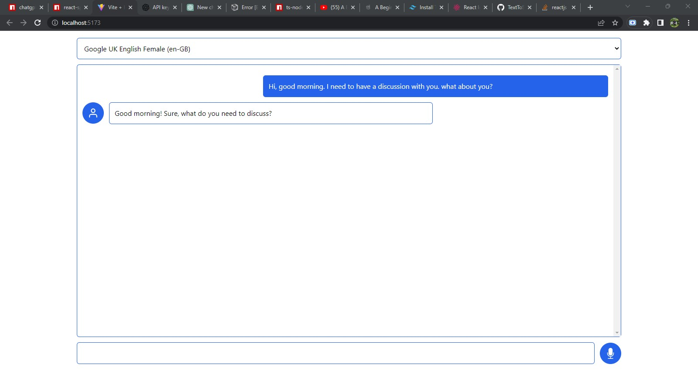

# CHAT WITH AN AI

This is a simple React application that allows users to chat with an AI using the OpenAI GPT library. The app uses the `openai` and `react-speech-kit` library to allow users to send messages using speech-to-text, and to receive responses using text-to-speech.

## Features

- Speech-to-text messaging
- Text-to-speech responses
- Choice of voices and languages

## Installation

To run the app, follow these steps:

1.  Clone the repository to your local machine.
2.  Run `yarn` to install the dependencies.
3.  Replace the `OPENAI_API_KEY` value of src/gpt.ts file with your OpenAI API key.
4.  Run `yarn dev` to start the development server.

## Usage

Once the app is running, enter a message in the input field at the bottom of the screen and press the send button or click mic icon to listen your message to send the message to the AI. The AI will respond with a message, which will be read out loud if text-to-speech is enabled. You can also use speech-to-text by clicking the microphone button next to the input field.

## Credits

This app uses following libraries:

- React
- OpenAI GPT
- react-speech-kit
- tailwindcss

## License

This project is licensed under the [MIT license](https://opensource.org/licenses/MIT).
